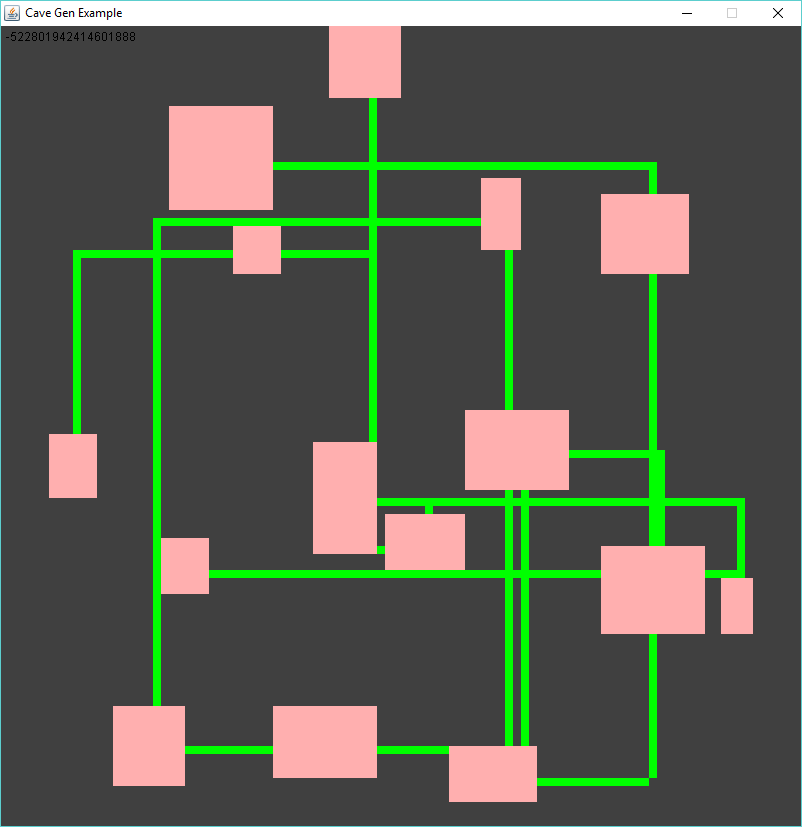
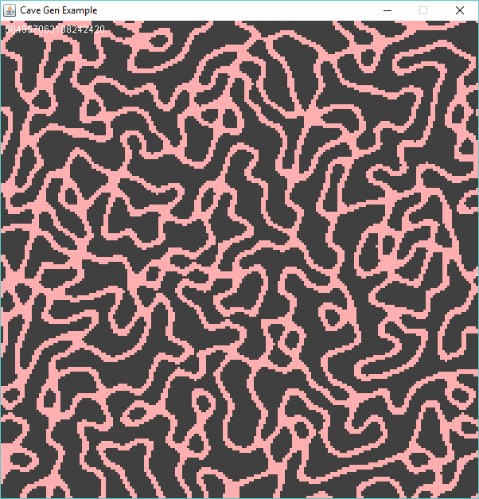
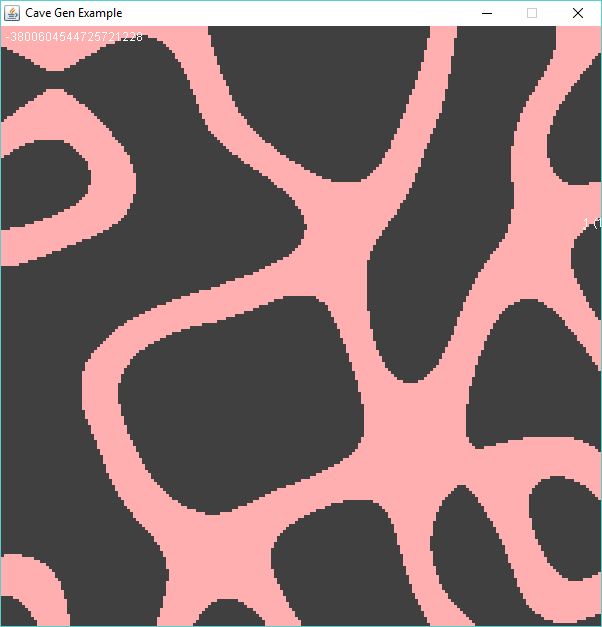
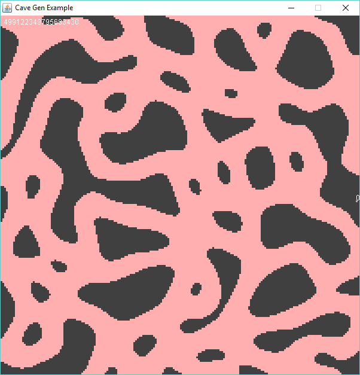

# Cave Generator
CaveGen is a [Java](http://java.com) library that I created in advanced for my __A Level Computer Science__ project.
This method uses the [OpenSimplex Noise](https://gist.github.com/KdotJPG/b1270127455a94ac5d19) method.

For a room/corridor type generation see the [basic](https://github.com/GOGO98901/CaveGen/tree/basic) branch

## Examples

